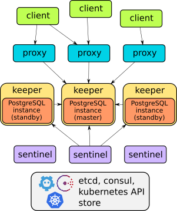

## Stolon Architecture and Requirements

### Components

Stolon is composed of 3 main components

* keeper: it manages a PostgreSQL instance converging to the clusterview provided by the sentinel(s).
* sentinel: it discovers and monitors keepers and calculates the optimal clusterview.
* proxy: the client's access point. It enforce connections to the right PostgreSQL master and forcibly closes connections to old masters.

### Requirements

#### Keepers

Every keeper MUST have a different UID that can be manually provided (`--uid` option) or will be generated. After the first start the keeper id (provided or generated) is saved inside the keeper data directory.

Every keeper MUST have a persistent data directory (no ephemeral volumes like k8s `emptyDir`) or you'll lose your data if all the keepers are stopped at the same time (since at restart no valid standby to failover will be available).

If you're providing the keeper's uid in the command line don't start a new keeper with the same id if you're providing a different data directory (empty or populated) since you're changing data out of the stolon control causing possible data loss or strange behaviors.

#### Sentinel and proxies

Sentinels and proxies don't need a local data directory but only use the store (etcd or consul). The sentinels and proxies uids are randomly generate at every process start to avoid possible collisions.

#### Store

Currently the store can be etcd (using v2 or v3 api) or consul, we leverage their features to achieve consistent and persistent cluster data.

The store should be high available (at least three nodes).

If etcd or consul becomes partitioned (network partition or store nodes dead/with problems), thanks to the raft protocol, only the quorate partition can accept writes.

When this happens the stolon components not able to read or write to a quorate partition (stolon uses quorum reads) will just retry talking with it.

In addition, the stolon-proxy, if not able to talk with the store, to avoid sending client connections to a paritioned master, will drop all the connections since it cannot know if the cluster data has changed (for example if the proxy has problems reading from the store but the sentinel can write to it).

##### Handling permanent loss of the store.

If you have permanently lost your store you can create a new one BUT don't restore its contents (at least the stolon ones) from a backup since the backed up data could be older than the current real state and this could cause different problems. For example if you restore a stolon cluster data where the elected master was different than the current one, you can end up with this old master becoming the new master.

The cleaner way is to reinitialize the stolon cluster using the `existing` `initMode` (see [Cluster Initialization](initialization.md)).

#### PostgreSQL Users

Stolon requires two kind of users:

* a superuser
* a replication user

The superuser is used for:
* managing/querying the keepers' controlled instances
* execute (if enabled) pg_rewind based resync

The replication user is used for:
* managing/querying the keepers' controlled instances
* replication between postgres instances

Currently trust (password-less) and md5 password based authentication are supported. In the future, different authentication mechanisms will be added.

To avoid security problems (user credentials cannot be globally defined in the cluster specification since if not correctly secured it could be read by anyone accessing the cluster store) these users and their related passwords must be provided as options to the stolon keepers and their values MUST be the same for all the keepers (or different things will break). These options are `--pg-su-username`, `--pg-su-password/--pg-su-passwordfile`, `--pg-repl-username` and `--pg-repl-password/--pg-repl-passwordfile`

Utilizing `--pg-su-auth-method/--pg-repl-auth-method` trust is not recommended in production environments, but they may be used in place of password authentication. If the same user is utilized as superuser and replication user, the passwords and auth methods must match.

When a keeper initializes a new pg db cluster, the provided superuser and replication user will be created.

#### Exceeding postgres max_connections

When external clients exceeds the number of postgres max connections, new replication connection will fail blocking standbys from syncing. So always ensure to avoid this case or increase the max_connections postgres parameter value.

Superuser connections will instead continue working until exceeding the `superuser_reserved_connections` value.
For this reason external connections to the db as superuser should be avoided or they can exhaust the `superuser_reserved_connections` blocking the keeper from correctly managing and querying the instance status (reporting the instance as not healthy).
