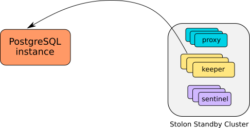
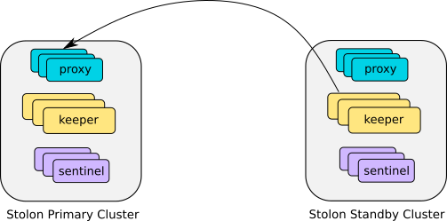

## Stolon standby cluster

A stolon cluster can be initialized as a standby of another remote postgresql instance (being it another stolon cluster or a standalone instance or any other kind of architecture).

This is useful for a lot of different use cases:

* Disaster recovery
* (near) Zero downtime migration to stolon

In a stolon standby cluster the master keeper will be the one that will sync with the remote instance, while the other keepers will replicate with the master keeper (creating a cascading replication topology).
Everything else will work as a normal cluster, if a keeper dies another one will be elected as the cluster master.

#### A standby cluster of a standalone postgres instance


#### A standby cluster of another stolon cluster



### Initializing a stolon standby cluster

#### Prerequisites

* The remote postgresql primary should have defined a superuser and user with replication privileges (can also be the same superuser) and accept remote logins from the replication user (be sure `pg_hba.conf` contains the required lines).
* You should provide the above user credentials to the stolon keepers (`--pg-su-username --pg-su-passwordfile/--pg-su-password --pg-repl-username --pg-repl-passwordfile/--pg-repl-password`)

**NOTE:** In future we could improve this example using other authentication methods like client TLS certificates.

In this example we'll use the below information:

* remote instance host: `remoteinstancehost`
* remote instance port: `5432`
* remote instance replication user name: `repluser`
* remote instance replication user password: `replpassword`
* stolon cluster name: `stolon-cluster`
* stolon store type: `etcd` (listening on localhost with default port to make it simple)

We can leverage stolon [Point in time Recovery](pitr.md) feature to clone from a remote postgres db. For example we can use `pg_basebackup` to initialize the cluster. We have to call `pg_basebackup` providing the remote instance credential for a replication user. To provide the password to `pg_basebackup` we have to create a password file like this:

```
remoteinstancehost:5432:*:repluser:replpassword
```

ensure to set the [right permissions to the password file](https://www.postgresql.org/docs/current/static/libpq-pgpass.html).


* Start one or more stolon sentinels and one or more stolon keepers passing the right values for `--pg-su-username --pg-su-passwordfile/--pg-su-password --pg-repl-username --pg-repl-passwordfile/--pg-repl-password`

* Initialize the cluster with the following cluster spec:

```
stolonctl --cluster-name stolon-cluster --store-backend=etcd init '
{
  "role": "standby",
  "initMode": "pitr",
  "pitrConfig": {
    "dataRestoreCommand": "PGPASSFILE=passfile pg_basebackup -D \"%d\" -h remoteinstancehost -p 5432 -U repluser"
  },
  "standbySettings": {
    "primaryConnInfo": "host=remoteinstancehost port=5432 user=repluser password=replpassword sslmode=disable"
  }
}'
```

If all is correct the sentinel will choose a keeper as the cluster "master" and this keeper will start the db pitr using the `pg_basebackup` command provided in the cluster specification.

If the command completes successfully the master keeper will start as a standby of the remote instance using the recovery options provided in the cluster spec `standbySettings` (this will be used to generate the `recovery.conf` file).

The other keepers will become standby keepers of the cluster master keeper.

### Additional options

You can specify additional options in the `standbySettings` (for all the options see the [cluster spec doc](https://github.com/sorintlab/stolon/blob/master/doc/cluster_spec.md#standbysettings))

For example you can specify a primary slot name to use for syncing with the master and a wal apply delay

Ex. with a primary slot name:
```
  "standbySettings": {
    "primaryConnInfo": "host=remoteinstancehost port=5432 user=repluser password=replpassword sslmode=disable",
    "primarySlotName": "standbycluster"
  }

```

### Promoting a standby cluster

When you want to promote your standby cluster to a primary one (for example in a disaster recovery scenario to switch to a dr site, or during a migration to switch to the new stolon cluster) you can do this using `stolonctl`:

```
stolonctl --cluster-name stolon-cluster --store-backend=etcd promote
```

This is the same as doing:

```
stolonctl --cluster-name stolon-cluster --store-backend=etcd update --patch { "role": "master" }
```
